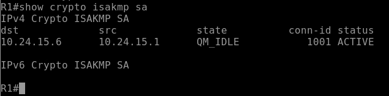
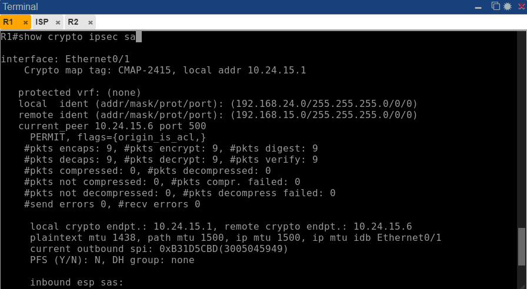
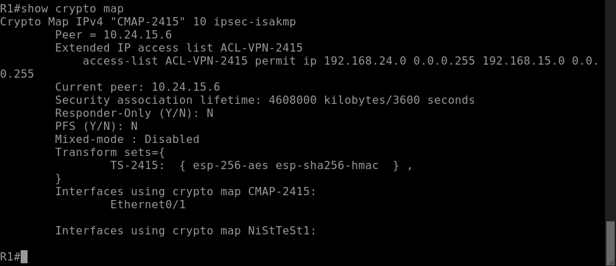
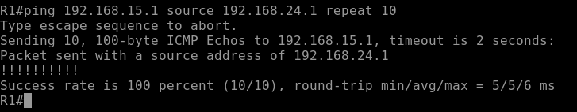

# VPN Site-to-Site IPSec IKEv1 Policy-Based

**Estudiante:** Edwin De Paula  
**Matricula:** 2024-2415  
**Institución:** Instituto Tecnológico de las Américas (ITLA)  
**Asignatura:** Seguridad en Redes
**Video YouTube:** https://youtu.be/Es_zn1c0BWE
---

## Objetivo

Implementar una VPN Site-to-Site basada en políticas utilizando IPSec con IKEv1, estableciendo un canal cifrado entre dos sitios remotos a través de un router ISP, garantizando la confidencialidad, integridad y autenticación del tráfico entre las redes LAN de cada sitio.

---

## Topología


| Dispositivo | Interfaz | Dirección IP | Descripción |
|---|---|---|---|
| R1 | Ethernet0/0 | 192.168.24.1/24 | LAN Site A |
| R1 | Ethernet0/1 | 10.24.15.1/30 | WAN hacia ISP |
| ISP | Ethernet0/0 | 10.24.15.2/30 | WAN hacia R1 |
| ISP | Ethernet0/1 | 10.24.15.5/30 | WAN hacia R2 |
| R2 | Ethernet0/0 | 10.24.15.6/30 | WAN hacia ISP |
| R2 | Ethernet0/1 | 192.168.15.1/24 | LAN Site B |
| PC-A | eth0 | 192.168.24.10/24 | Gateway: 192.168.24.1 |
| PC-B | eth0 | 192.168.15.10/24 | Gateway: 192.168.15.1 |

---

## Parámetros de Configuración

### Fase 1 - IKEv1 (ISAKMP)

| Parámetro | Valor |
|---|---|
| Política | 10 |
| Cifrado | AES 256 |
| Hash | SHA-256 |
| Autenticación | Pre-shared Key |
| Grupo Diffie-Hellman | Grupo 14 (2048 bits) |
| Lifetime | 86400 segundos (24 horas) |
| Pre-shared Key | Edwin2024 |

### Fase 2 - IPSec (Transform Set)

| Parámetro | Valor |
|---|---|
| Nombre | TS-2415 |
| Protocolo | ESP |
| Cifrado | AES 256 |
| Integridad | SHA-256 HMAC |
| Modo | Tunnel |

### Crypto Map

| Parámetro | Valor |
|---|---|
| Nombre | CMAP-2415 |
| Secuencia | 10 |
| Peer R1 | 10.24.15.1 |
| Peer R2 | 10.24.15.6 |
| ACL interesante | ACL-VPN-2415 |

---

## Explicación de la Configuración

### ¿Qué es una VPN Policy-Based?

En una VPN basada en políticas, el tráfico que debe ser cifrado se define mediante una Access Control List (ACL). Cuando un paquete coincide con la ACL configurada en el crypto map, el router lo encapsula y cifra dentro del túnel IPSec. A diferencia de una VPN route-based, no se crea una interfaz de túnel virtual; el cifrado ocurre directamente en la interfaz WAN física.

### Flujo de Negociación

1. PC-A genera tráfico hacia la red 192.168.15.0/24
2. R1 evalúa el paquete contra ACL-VPN-2415 — coincide
3. R1 inicia negociación IKEv1 Fase 1 con R2 (10.24.15.6)
4. Se establece el canal ISAKMP seguro (SA de Fase 1)
5. Se negocia la SA de Fase 2 (IPSec SA) usando el transform set TS-2415
6. El tráfico fluye cifrado entre ambos sitios

### ACL Interesante

La ACL define exactamente qué tráfico activa el túnel:

```
permit ip 192.168.24.0 0.0.0.255 192.168.15.0 0.0.0.255
```

El tráfico que no coincide con esta ACL sale por la interfaz WAN sin cifrar. Esta es la diferencia fundamental con una VPN route-based, donde el enrutamiento determina qué tráfico entra al túnel.

---

## Verificación

### Verificar Fase 1 - ISAKMP SA

```
show crypto isakmp sa
```



El estado `QM_IDLE` con status `ACTIVE` confirma que la Fase 1 se estableció correctamente.

### Verificar Fase 2 - IPSec SA

```
show crypto ipsec sa
```



Los campos críticos a verificar:

- `#pkts encaps / #pkts encrypt` — paquetes cifrados salientes
- `#pkts decaps / #pkts decrypt` — paquetes descifrados entrantes
- `Status: ACTIVE(ACTIVE)` — SA operativa en ambas direcciones
- `transform: esp-256-aes esp-sha256-hmac` — parámetros correctos aplicados

### Verificar Crypto Map

```
show crypto map
```



### Prueba de Conectividad

```
ping 192.168.15.1 source 192.168.24.1 repeat 10
```



---

## Archivos del Repositorio

```
ipsec-ikev1-policy-based/
├── configs/
│   ├── R1.txt       — Configuración completa de R1 (Peer A)
│   ├── ISP.txt      — Configuración completa del router ISP
│   └── R2.txt       — Configuración completa de R2 (Peer B)
├── docs/
│   └── screenshots/
│       ├── topology.png
│       ├── isakmp-sa.png
│       ├── ipsec-sa.png
│       ├── crypto-map.png
│       └── ping-test.png
└── README.md
```

---

## Herramientas Utilizadas

- PNetLab — Plataforma de emulación de red
- Cisco IOSv 15.4(2)T4 — Imagen de router emulado
- VMware — Virtualización del servidor PNetLab
